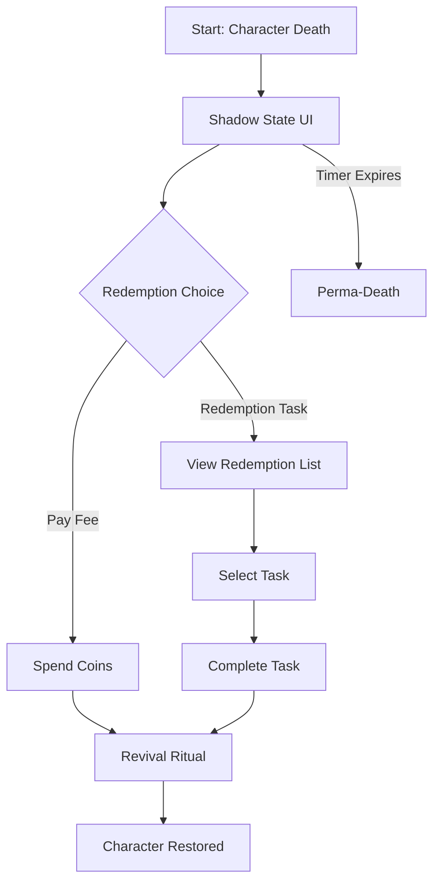
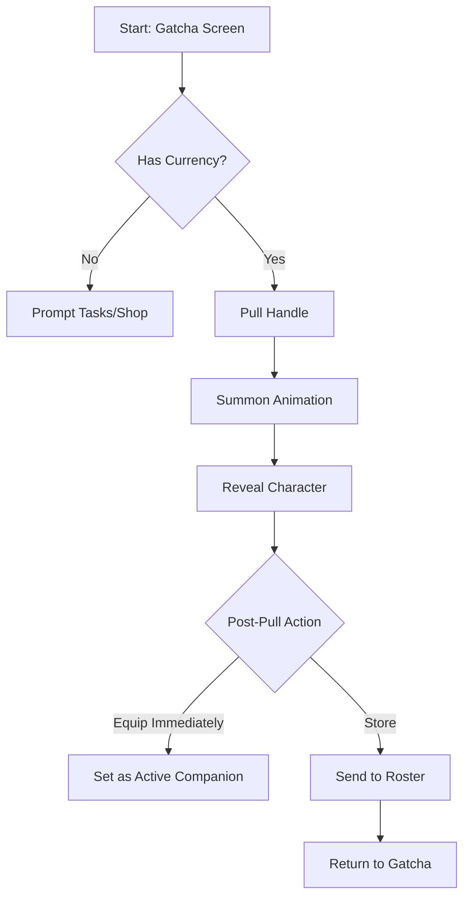

```
---
stepsCompleted: [1, 2, 3, 4, 5, 6, 7, 8, 9, 10, 11, 12, 13, 14]
inputDocuments:
  - "_bmad-output/planning-artifacts/prd.md"
  - "docs/index.md"
  - "docs/project-overview.md"
  - "docs/architecture.md"
  - "docs/data-models.md"
---

# UX Design Specification - GatchaLife

**Author:** Tlafay
**Date:** 2026-01-11

---

<!-- UX design content will be appended sequentially through collaborative workflow steps -->

## Executive Summary

### Project Vision
GatchaLife is a gamified productivity ecosystem that replaces the abstract "Task List" with a "Living Companion." It uses **Loss Aversion** (Mood Decay/Death) and **Asset Ownership** (AI-Generated Characters) to drive engagement. The primary interface is a **Mobile Widget** acting as a "Wingman."

### Target Users

1.  **Alex (The Procrastinator):** Needs low-friction "nudges" from the Widget to start small tasks.
2.  **Sarah (The Deep Worker):** Needs a passive, ambient Desktop companion that reflects her productive state.
3.  **Leo (The Creator):** Motivated by customizing and "minting" unique AI characters.

### Key Design Challenges

1.  **The "Sadness" Balance:** Visualizing Negative States (Pouting/Distressed) without making the app feel depressing or repulsive to open.
2.  **Widget Constraints:** Conveying complex state (Mood + Task + Debuff) in a small, static homescreen widget.
3.  **"Haunting" Feedback:** Clearly communicating *why* the user has a 50% debuff and *how* to fix it (Exorcise/Revive) without burying it in menus.

### Design Opportunities

1.  **Dynamic Portraits:** Using the 5 mood tiers (Extremely Happy -> Dead) to create a highly responsive emotional feedback loop.
2.  **"Ritual" Interactions:** Making the acts of "Reviving" or "Minting" feel like significant, magical events to build value.

## Core User Experience

### Defining Experience
The heartbeat of GatchaLife is the **"Wingman Intervention."** Users shouldn't be spending time *in* the app managing lists; they should be glancing at their companion, feeling a pang of empathy/duty, and immediately doing the task to "save" them.

### Platform Strategy
**Mobile-First (Hybrid):**
The primary interface is the **Android Widget**. The App itself is a "Maintenance Hangar" (viewing roster, minting) visited less frequently.
-   **Touch:** Large, forgiving tap targets for the "Complete Task" action.
-   **Glanceability:** Information (Mood/Task) must be readable in sunlight/ambient modes.

### Effortless Interactions
1.  **The "One-Tap" Fix:** Completing the top task must be achievable directly from the notification or widget deep-link with zero navigation.
2.  **Passive Styling:** The companion's mood updates automatically (Server-Push). The user never has to "refresh" to see how their pet is doing.
3.  **Frictionless Minting:** To prevent "Blank Canvas Paralysis" during character creation, the system pre-generates 3 diverse options daily, allowing "One-Tap Minting" alongside custom prompting.

### Critical Success Moments
1.  **The "Creation" (First Mint):** The user types "Cyberpunk Fox" and gets a high-quality, unique image. *Success = "I made this."* (IKEA Effect).
2.  **The "Rescue" (Theatrical Death):** "Death" must not be a static screen. It should be a dramatic, impactful event (e.g., visual glitching, greyscale wash, somber music) that makes the "Revival" feel like a heroic rescue. *Success = "I saved them."* (Relief).

### Experience Principles
1.  **Ambient Connection:** The app lives in the periphery (Widgets/Desktop), not demanding focus until necessary.
2.  **Visuals Over Text:** Show the mood (Crying face), don't just say "Mood: 20%".
3.  **High-Stakes Simplicity:** Keep interactions simple (Do Task / Don't Do Task), but make the consequences heavy (Death).
4.  **Clarity of Consequence:** If a character dies, the "Asset Lock" (Shadow State) must be unmistakable to validate the loss.

## Desired Emotional Response

### Primary Emotional Goals
1.  **Pride (The Builder's High):** The user feels proud of the *system* they built and maintained. The physical device is the trophy.
2.  **Reassurance (The Anchor):** The app is a "Safe Place." It validates that the user can handle their load.
3.  **Parental Relief:** Reviving a character feels like saving a loved one, not just fixing a bug.

### Emotional Journey Mapping
1.  **Maintenance:** Responsibility & Care.
2.  **Death:** Guilt & Determination to fix it.
3.  **Revival:** Relief & Redemption.
4.  **Showcase:** Pride in the creation (Code + Device).

### Micro-Emotions
-   **Lore-Accurate Connection:** Interactions must feel authentic to the character's canon (e.g., Naruto feels like Naruto).
-   **Stability:** The app's performance itself provides emotional security.

### Design Implications
1.  **Warmth over Data:** The UI should feel like a living environment, not a spreadsheet.
2.  **Canon Voice:** System messages (especially high-stakes ones like Death/Revival) should use character-specific voice/lore.
3.  **Stability as a Feature:** Zero-latency widgets to reinforce the "Reliable Anchor" feeling.

## UX Pattern Analysis & Inspiration

### Inspiring Products Analysis
1.  **Duolingo:**
    *   **The "Human" Mascot:** The owl isn't just a logo; it's a character with agency that "nags," cries, or celebrates. It emotionalizes the algorithm.
    *   **Lesson:** Our companion must communicate *directly* to the user, not through generic system toasts.

2.  **Pokémon Sleep:**
    *   **Passive Progression:** You do a "hard" real-world task (sleeping), and the app visualizes the growth *afterward*. It gamifies a passive activity.
    *   **Warning (Anti-Pattern):** User mentioned "losing interest." This often happens when the "Loop" becomes too predictable or evolution is too slow. We must ensure *novelty* (e.g., finding rare variants) remains high.

3.  **Hinge:**
    *   **The "Match" Dopamine:** The thrill of revealing a new connection.
    *   **Lesson:** The "Minting" or "Card Reveal" process should feel like a high-stakes "Dating Match"—visual, exciting, and full of potential.

### Transferable UX Patterns
1.  **The "Active Mascot" (Duolingo):** Use the companion images in widgets/notifications to deliver the message (e.g., a crying fox says "Don't ignore me" vs a text notification).
2.  **The "Evolution Reveal" (Pokémon Sleep):** Don't show the growth immediately. Let the user complete tasks, then have a "Morning Report" or "Daily Check-in" where they see how much their companion grew.
3.  **The "High-Fidelity Card" (Hinge):** When viewing a character, give it the full screen. Make the art the hero.

### Anti-Patterns to Avoid
1.  **The "Stagnant Loop" (Pokémon Sleep):** Avoid making the rewards feel like a "grind" with no surprise.
2.  **Generic Notifications:** Never send a push notification that says "You have tasks due." It must be "Fox is getting anxious."

### Design Inspiration Strategy
1.  **Adopt:** Duolingo's "Emotional Manipulation" (in a good way) via the Mascot.
2.  **Adapt:** Hinge's "Card Stack" UI for the Character Roster and Minting results.
3.  **Avoid:** The slow, grindy progression of Pokémon Sleep. Keep the feedback loop tight (daily changes).

## Design System Foundation

### 1.1 Design System Choice
**System:** **shadcn-vue** (Radix Vue + Tailwind CSS)

### Rationale for Selection
1.  **"Accessible Foundation" (Radix):** We get robust, accessible functionality (Focus management, ARIA) for free, which supports our "Stability as a Feature" principle.
2.  **"Themeable Vibe" (Tailwind):** Shadcn is "Headless" by design. It gives us the component structure (e.g., a Dialog or Select) but leaves the styling entirely to Tailwind classes, allowing us to break away from the "SaaS Look" and implement our Custom Game Aesthetic easily.
3.  **Code Ownership:** Since Shadcn components are copied into the project (not a node_module dependency), we have full control to modify them deeply if a specific "Game Mechanic" requires it.

### Implementation Approach
-   **Base:** Install shadcn-vue CLI.
-   **Typography:** Override defaults with "Inter" (Clean) or a "Monospace" (Code/Terminal vibe) font.
-   **Radius:** Tune border-radius to feel "Soft" (Friendly/Organic) or "Sharp" (Tech/Cyberpunk) based on the specific "Lore" direction.

### Customization Strategy
-   **The "Game" Layer:** We will add a custom Tailwind configuration for "Game Tiers" (e.g., `bg-rarity-legendary`, `text-mood-distressed`) to allow semantic styling of gamified elements.
-   **Avoid "SaaS Default":** We will explicitly override the default "Slate/Gray" neutral palettes with slightly tinted grays (e.g., Slate or Zinc with a touch of purple/blue) to maintain the "Atmosphere."

## 2. Core User Experience

### 2.1 Defining Experience
The **"Caretaker Loop"** is the central interaction. Users care for their companion through a mix of **Low-Friction Interactions** (Feeding, Petting) and **High-Value Actions** (Completing Real-World Tasks) to maintain Happiness.
*   **Primary:** "Maintenance" (Daily care to keep mood high).
*   **Secondary:** "Minting" (Creating unique, high-value assets to care for).
*   **Tertiary:** "Revival" (High-stakes redemption mission).

### 2.2 User Mental Model
**"Tamagotchi meets To-Do List."**
*   **Expectation:** "Petting" should be instant and delightful. "Healing" (repairing a bad mood) requires "Work" (Tasks).
*   **Mental Switch:** The app is a "Living System" that needs daily attention, not a static list I can ignore.

### 2.3 Success Criteria
1.  **Immediate Visual Feedback:** When a task is completed, the Mood MUST visually upgrade immediately (e.g., Pouting -> Neutral).
2.  **Urgency without Impossibility:** "Revival" must feel urgent (Timer/Debuff) to create stakes, but the "Redemption Task" must be achievable so the user doesn't quit.
3.  **Progression Visibility:** Minted characters must feel like they are accumulating value (Lore/Stats) over time.

### 2.4 Novel UX Patterns
**"The Haunting (Global Debuff):"**
Unlike standard gamification (which just stops rewarding you), GatchaLife actively *penalizes* the system (Coin Multiplier -50%) when a character is dead. This forces a "Repair" interaction, shifting the user from "Passive" to "Urgent Action."

### 2.5 Experience Mechanics
**1. The Maintenance Loop (Daily):**
*   **Trigger:** Mood decays to < 80% (Pouting/Neutral).
*   **Action:** User clicks Widget -> Completes Task (Health++) OR Pets/Feeds (Mood+).
*   **Feedback:** Character animation plays (Happy), Mood Bar fills, Face updates on Widget.

**2. The Revival Loop (Crisis):**
*   **Trigger:** Mood hits 0% (Shadow State). Global "Haunting" Debuff active.
*   **Action:** User selects "Revive." System demands a **"Redemption Fee"** (Coins) or **"Redemption Task"** (High difficulty task).
*   **Success:** "Resurrection" Animation. Character restored. Debuff cleared.
*   **Failure:** Timer expires (e.g., 24h). Character is **Permanently Deleted**.

## Visual Design Foundation

### Color System: "Cozy Fantasy"
**Philosophy:** "Relaxing, not alerting."
*   **Backgrounds:** Avoid stark white (`#FFFFFF`). Use **Cream/Off-White** (`#FAFAF5`) or **Soft Lavender** (`#F3F0FF`) to reduce eye strain and feel "warm."
*   **Primary Action:** **Sakura Pink** (`#FFB7B2`) or **Sky Blue** (`#AEC6CF`) - soft, inviting, touchable.
*   **Status Colors:**
    *   *Happy:* Soft Mint Green.
    *   *Distressed:* Muted Coral (Not shouting Red).
    *   *Death:* Deep Violet/Indigo (Magical consequence, not "System Error").

### Typography System
**Font:** **Rounded Sans** (e.g., `M PLUS Rounded 1c` or `Varela Round`).
*   **Role:** Matches the "Chibi" aesthetic—soft edges, friendly characters.
*   **Headings:** Bold, "Bubble-like" weight.
*   **Body:** Clean but readable with relaxed letter-spacing.

### Spacing & Layout Foundation
**"The Floating Gallery"**
*   **Cards:** Uses **Glassmorphism** (White + 80% Opacity + Blur) or **Parchemin-style** cards floating on an animated background.
*   **Radius:** **High Border Radius** (`rounded-xl` or `rounded-2xl`). Everything is a "Pill" or a "Bubble." No sharp corners.
*   **Density:** **Airy.** Give the character art room to breathe. Controls (Feed, Pet) circle the character like magical orbits.

### Accessibility Considerations
*   **Contrast Check:** Pastel text on pastel backgrounds is a trap. We will use **Deep Slate/Indigo** for text (`text-slate-700`) to ensure readability on cream backgrounds while keeping the "soft" vibe.

## Design Direction Decision

### Design Directions Explored
1.  **The Glass Menagerie:** Modern, gradients, very functional app-like feel.
2.  **The Magic Tome:** Heavy RPG textures, paper, wood.
3.  **The Isekai Window:** Painted backgrounds, magical serif fonts, "Gamey."
4.  **The Spirit Sanctuary (Chosen):** Minimalist, intimate, removing UI layers to focus on the character bond.

### Chosen Direction
**Direction A: "The Glass Menagerie" (Modern/Premium)**

### Design Rationale
*   **Premium App Feel:** The user prefers a clean, high-fidelity application aesthetic over a "gamey" painted look.
*   **Clarity:** Stats and identity are clearly presented in structured cards and pills, offering better visibility of the system state.
*   **Focus:** The centralized "Showcase" design elevates the character, treating them like a prized digital collection.
*   **Aesthetics:** Soft, dreamy gradients and glassmorphism create a modern, calming environment.

### Implementation Approach
*   **Layers:**
    1.  **Background:** Soft, multi-stop gradient (Lavender/Pink/Blue).
    2.  **Glass Layer:** Minimized. Clean white/glass elements only where necessary.
    3.  **Character:** Centralized "Showcase". **No Nameplate** (Visual focus only).
*   **Components:**
    -   **Progression:** Visual Level + XP Indicator (Circular or Bar, no precise numbers needed).
    -   **Resource:** **"Mana" System** (Merged Mood/Energy). Represented by a magical blue/purple bar or orb.
    -   **Action Button:** Prominent, high-contrast floating dock.

## User Journey Flows

### 1. The Maintenance Loop (Daily Care)
**Goal:** Maintain character happiness through consistent engagement.
**Philosophy:** "Nagging but cute." Use notifications to pull user back.

```mermaid
graph TD
    A[Start: Pouting State] -->|Widget Update| B{User Response?}
    B -->|Ignored| C[Escalate Notification]
    C -->|Still Ignored| D[Mood Decay --]
    B -->|Interacts| E[Open App / Widget]
    E --> F{Action Type}
    F -->|Care (Pet/Feed)| G[Mood ++]
    F -->|Work (Complete Task)| H[Health ++ / Mood +++]
    G --> I[Happy Animation]
    H --> I
    I --> J[End: Sanctuary Restored]
```

### 2. The Revival Loop (Crisis Management)
**Goal:** Recover from a "Death State" without feeling discouraged.
**Philosophy:** "Redemption, not Punishment." Give a clear path back.



### 3. The Gatcha Loop (Reward)
**Goal:** Acquire new companions to care for.
**Philosophy:** "Expand the Family." New characters don't replace old ones immediately.



### Journey Patterns
1.  **"Contextual Actions":** Secondary actions (Feed/Pet) are grouped or revealed on interaction to keep the main interface clean and focused on the character.
2.  **"Redemption Lists":** Never block the user with a single impossible task. Always offer a choice from a pool of tasks to unblock a state.
3.  **"Roster Buffering":** New acquisitions go to inventory by default to avoid disrupting the current "Bond" with the active companion.

### Flow Optimization Principles
*   **Zero-Click Info:** Mood/Health must be visible on the Widget without opening the app.
*   **One-Tap Care:** "Feeding" should not require opening a menu. It's a direct action on the character.

