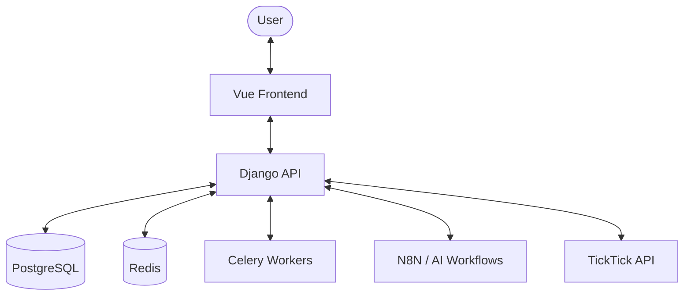

# Architecture Documentation - GatchaLife

This document outlines the system architecture and high-level design of the GatchaLife project.

## System Overview
GatchaLife consists of a Vue-based frontend and a Django-based backend. The system interacts with N8N for AI image generation and TickTick for task data.

## Backend Architecture (GatchaLife-backend)
The backend is a traditional Django application structured into functional modules (apps):

| App | Responsibility |
| :--- | :--- |
| `character` | Character definitions, variants, and metadata. |
| `gamification` | Players, cards, quests, and tamagotchi state/mechanics. |
| `generated_image` | Storage and management of AI-generated assets. |
| `style` | Themes, rarities, and visual styles for cards/characters. |
| `ticktick` | Integration layer with TickTick (projects, columns, tasks). |
| `workflow_engine` | Registry and management for async jobs and AI workflows. |

### Key Patterns
- **Service Layer:** Business logic is often encapsulated in `services.py` within apps.
- **ViewSets:** Using DRF ViewSets for standardized RESTful endpoints.
- **Celery Tasks:** Background processing for tamagotchi decay and image generation polling.

## Frontend Architecture (GatchaLife-frontend)
The frontend is a modern SPA built with Vue 3 and Vite.

### Core Modules
- **API Client:** Generated from the backend OpenAPI schema (located in `src/api`).
- **Composables:** Reusable logic for state management and API interactions.
- **UI Components:** Built on a design system using Tailwind CSS and `radix-vue`.

### Project Structure
- `src/gamification`: Views and components related to the core game loop.
- `src/character`: Character management and editing interfaces.
- `src/api`: Auto-generated API services and models.
- `src/components/ui`: Low-level design system components.

## Integration Architecture
- **API Communication:** Frontend uses `fetch` via generated services to interact with DRF.
- **AI Integration:** Backend triggers N8N webhooks for heavy AI tasks (image generation, profiling).
- **Task Gamification:** Periodic sync with TickTick rewards players based on completed tasks.
